<!-- Generated by `bun run index.ts` from src/ — edit there, not here. -->

<picture><source media="(min-width: 1280px) and (prefers-color-scheme: dark)" srcset="./assets/hero-desktop-dark.svg" width="744" height="300" /><source media="(min-width: 1280px) and (prefers-color-scheme: light)" srcset="./assets/hero-desktop-light.svg" width="744" height="300" /><source media="(min-width: 768px) and (prefers-color-scheme: dark)" srcset="./assets/hero-mobile-dark.svg" width="420" /><source media="(min-width: 768px) and (prefers-color-scheme: light)" srcset="./assets/hero-mobile-light.svg" width="420" /><source media="(prefers-color-scheme: dark)" srcset="./assets/hero-mobile-dark.svg" width="280" /></picture> <picture><source media="(min-width: 1280px) and (prefers-color-scheme: dark)" srcset="./assets/tiles/label-work-desktop-dark.png" width="744" height="76" /><source media="(min-width: 1280px) and (prefers-color-scheme: light)" srcset="./assets/tiles/label-work-desktop-light.png" width="744" height="76" /><source media="(min-width: 768px) and (prefers-color-scheme: dark)" srcset="./assets/tiles/label-work-mobile-dark.png" width="420" /><source media="(min-width: 768px) and (prefers-color-scheme: light)" srcset="./assets/tiles/label-work-mobile-light.png" width="420" /><source media="(prefers-color-scheme: dark)" srcset="./assets/tiles/label-work-mobile-dark.png" width="280" /></picture> <a href="https://devx.parthkapoor.me"><picture><source media="(min-width: 1280px) and (prefers-color-scheme: dark)" srcset="./assets/tiles/project-devx-desktop-dark.png" width="248" height="412" /><source media="(min-width: 1280px) and (prefers-color-scheme: light)" srcset="./assets/tiles/project-devx-desktop-light.png" width="248" height="412" /><source media="(min-width: 768px) and (prefers-color-scheme: dark)" srcset="./assets/tiles/project-devx-mobile-dark.png" width="140" /><source media="(min-width: 768px) and (prefers-color-scheme: light)" srcset="./assets/tiles/project-devx-mobile-light.png" width="140" /><source media="(prefers-color-scheme: dark)" srcset="./assets/tiles/project-devx-mobile-dark.png" width="93" />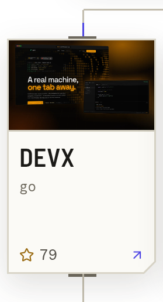</picture></a><a href="https://void.parthkapoor.me"><picture><source media="(min-width: 1280px) and (prefers-color-scheme: dark)" srcset="./assets/tiles/project-void-design-desktop-dark.png" width="248" height="412" /><source media="(min-width: 1280px) and (prefers-color-scheme: light)" srcset="./assets/tiles/project-void-design-desktop-light.png" width="248" height="412" /><source media="(min-width: 768px) and (prefers-color-scheme: dark)" srcset="./assets/tiles/project-void-design-mobile-dark.png" width="141" /><source media="(min-width: 768px) and (prefers-color-scheme: light)" srcset="./assets/tiles/project-void-design-mobile-light.png" width="141" /><source media="(prefers-color-scheme: dark)" srcset="./assets/tiles/project-void-design-mobile-dark.png" width="94" />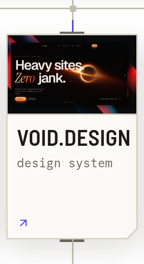</picture></a><a href="https://zenith.parthkapoor.me"><picture><source media="(min-width: 1280px) and (prefers-color-scheme: dark)" srcset="./assets/tiles/project-zenith-ai-desktop-dark.png" width="248" height="412" /><source media="(min-width: 1280px) and (prefers-color-scheme: light)" srcset="./assets/tiles/project-zenith-ai-desktop-light.png" width="248" height="412" /><source media="(min-width: 768px) and (prefers-color-scheme: dark)" srcset="./assets/tiles/project-zenith-ai-mobile-dark.png" width="140" /><source media="(min-width: 768px) and (prefers-color-scheme: light)" srcset="./assets/tiles/project-zenith-ai-mobile-light.png" width="140" /><source media="(prefers-color-scheme: dark)" srcset="./assets/tiles/project-zenith-ai-mobile-dark.png" width="93" />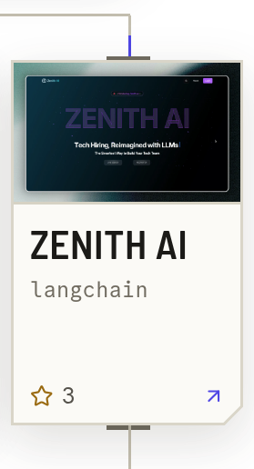</picture></a> <a href="https://better-axios.parthkapoor.me"><picture><source media="(min-width: 1280px) and (prefers-color-scheme: dark)" srcset="./assets/tiles/project-better-axios-desktop-dark.png" width="372" height="176" /><source media="(min-width: 1280px) and (prefers-color-scheme: light)" srcset="./assets/tiles/project-better-axios-desktop-light.png" width="372" height="176" /><source media="(min-width: 768px) and (prefers-color-scheme: dark)" srcset="./assets/tiles/project-better-axios-mobile-dark.png" width="210" /><source media="(min-width: 768px) and (prefers-color-scheme: light)" srcset="./assets/tiles/project-better-axios-mobile-light.png" width="210" /><source media="(prefers-color-scheme: dark)" srcset="./assets/tiles/project-better-axios-mobile-dark.png" width="140" />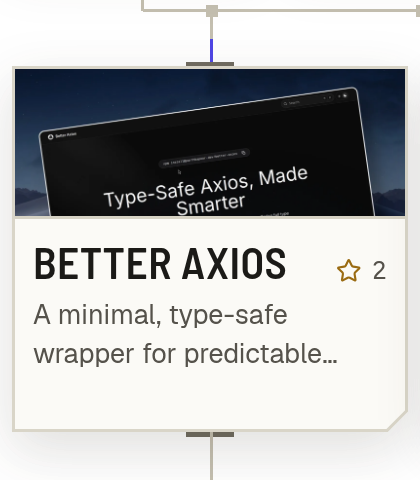</picture></a><a href="https://lexa.parthkapoor.me"><picture><source media="(min-width: 1280px) and (prefers-color-scheme: dark)" srcset="./assets/tiles/project-lexa-ai-desktop-dark.png" width="372" height="176" /><source media="(min-width: 1280px) and (prefers-color-scheme: light)" srcset="./assets/tiles/project-lexa-ai-desktop-light.png" width="372" height="176" /><source media="(min-width: 768px) and (prefers-color-scheme: dark)" srcset="./assets/tiles/project-lexa-ai-mobile-dark.png" width="210" /><source media="(min-width: 768px) and (prefers-color-scheme: light)" srcset="./assets/tiles/project-lexa-ai-mobile-light.png" width="210" /><source media="(prefers-color-scheme: dark)" srcset="./assets/tiles/project-lexa-ai-mobile-dark.png" width="140" />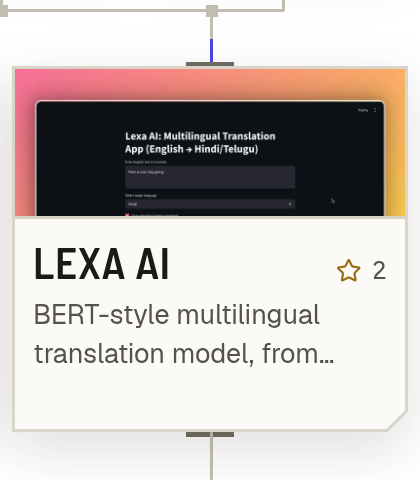</picture></a> <a href="https://github.com/parthkapoor-dev/hopster"><picture><source media="(min-width: 1280px) and (prefers-color-scheme: dark)" srcset="./assets/tiles/project-hopster-desktop-dark.png" width="248" height="158" /><source media="(min-width: 1280px) and (prefers-color-scheme: light)" srcset="./assets/tiles/project-hopster-desktop-light.png" width="248" height="158" /><source media="(min-width: 768px) and (prefers-color-scheme: dark)" srcset="./assets/tiles/project-hopster-mobile-dark.png" width="140" /><source media="(min-width: 768px) and (prefers-color-scheme: light)" srcset="./assets/tiles/project-hopster-mobile-light.png" width="140" /><source media="(prefers-color-scheme: dark)" srcset="./assets/tiles/project-hopster-mobile-dark.png" width="93" />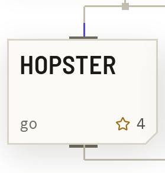</picture></a><a href="https://github.com/parthkapoor-dev/tori-cli"><picture><source media="(min-width: 1280px) and (prefers-color-scheme: dark)" srcset="./assets/tiles/project-tori-cli-desktop-dark.png" width="248" height="158" /><source media="(min-width: 1280px) and (prefers-color-scheme: light)" srcset="./assets/tiles/project-tori-cli-desktop-light.png" width="248" height="158" /><source media="(min-width: 768px) and (prefers-color-scheme: dark)" srcset="./assets/tiles/project-tori-cli-mobile-dark.png" width="141" /><source media="(min-width: 768px) and (prefers-color-scheme: light)" srcset="./assets/tiles/project-tori-cli-mobile-light.png" width="141" /><source media="(prefers-color-scheme: dark)" srcset="./assets/tiles/project-tori-cli-mobile-dark.png" width="94" />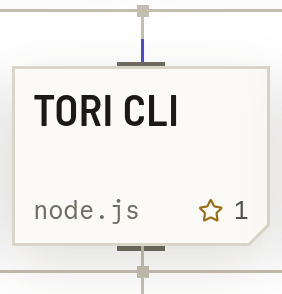</picture></a><a href="https://parthkapoor.me/projects"><picture><source media="(min-width: 1280px) and (prefers-color-scheme: dark)" srcset="./assets/tiles/project-index-desktop-dark.png" width="248" height="158" /><source media="(min-width: 1280px) and (prefers-color-scheme: light)" srcset="./assets/tiles/project-index-desktop-light.png" width="248" height="158" /><source media="(min-width: 768px) and (prefers-color-scheme: dark)" srcset="./assets/tiles/project-index-mobile-dark.png" width="140" /><source media="(min-width: 768px) and (prefers-color-scheme: light)" srcset="./assets/tiles/project-index-mobile-light.png" width="140" /><source media="(prefers-color-scheme: dark)" srcset="./assets/tiles/project-index-mobile-dark.png" width="93" />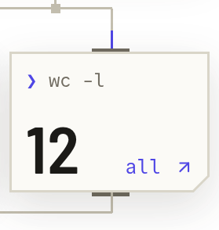</picture></a> <picture><source media="(min-width: 1280px) and (prefers-color-scheme: dark)" srcset="./assets/tiles/label-telemetry-desktop-dark.png" width="744" height="76" /><source media="(min-width: 1280px) and (prefers-color-scheme: light)" srcset="./assets/tiles/label-telemetry-desktop-light.png" width="744" height="76" /><source media="(min-width: 768px) and (prefers-color-scheme: dark)" srcset="./assets/tiles/label-telemetry-mobile-dark.png" width="420" /><source media="(min-width: 768px) and (prefers-color-scheme: light)" srcset="./assets/tiles/label-telemetry-mobile-light.png" width="420" /><source media="(prefers-color-scheme: dark)" srcset="./assets/tiles/label-telemetry-mobile-dark.png" width="280" />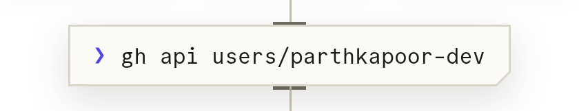</picture> <a href="https://github.com/parthkapoor-dev"><picture><source media="(min-width: 1280px) and (prefers-color-scheme: dark)" srcset="./assets/tiles/tele-heatmap-desktop-dark.png" width="496" height="204" /><source media="(min-width: 1280px) and (prefers-color-scheme: light)" srcset="./assets/tiles/tele-heatmap-desktop-light.png" width="496" height="204" /><source media="(min-width: 768px) and (prefers-color-scheme: dark)" srcset="./assets/tiles/tele-heatmap-mobile-dark.png" width="281" /><source media="(min-width: 768px) and (prefers-color-scheme: light)" srcset="./assets/tiles/tele-heatmap-mobile-light.png" width="281" /><source media="(prefers-color-scheme: dark)" srcset="./assets/tiles/tele-heatmap-mobile-dark.png" width="187" />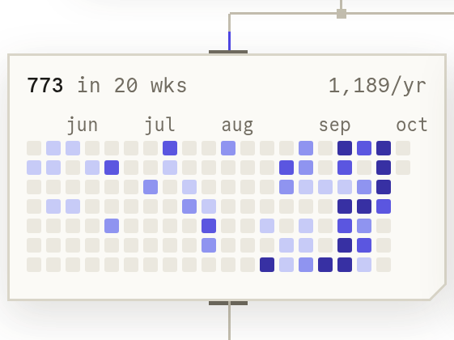</picture></a><a href="https://github.com/parthkapoor-dev"><picture><source media="(min-width: 1280px) and (prefers-color-scheme: dark)" srcset="./assets/tiles/tele-streak-desktop-dark.png" width="248" height="204" /><source media="(min-width: 1280px) and (prefers-color-scheme: light)" srcset="./assets/tiles/tele-streak-desktop-light.png" width="248" height="204" /><source media="(min-width: 768px) and (prefers-color-scheme: dark)" srcset="./assets/tiles/tele-streak-mobile-dark.png" width="140" /><source media="(min-width: 768px) and (prefers-color-scheme: light)" srcset="./assets/tiles/tele-streak-mobile-light.png" width="140" /><source media="(prefers-color-scheme: dark)" srcset="./assets/tiles/tele-streak-mobile-dark.png" width="93" />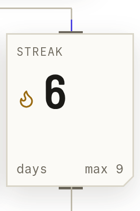</picture></a> <a href="https://github.com/parthkapoor-dev?tab=repositories"><picture><source media="(min-width: 1280px) and (prefers-color-scheme: dark)" srcset="./assets/tiles/tele-numbers-desktop-dark.png" width="248" height="222" /><source media="(min-width: 1280px) and (prefers-color-scheme: light)" srcset="./assets/tiles/tele-numbers-desktop-light.png" width="248" height="222" /><source media="(min-width: 768px) and (prefers-color-scheme: dark)" srcset="./assets/tiles/tele-numbers-mobile-dark.png" width="129" /><source media="(min-width: 768px) and (prefers-color-scheme: light)" srcset="./assets/tiles/tele-numbers-mobile-light.png" width="129" /><source media="(prefers-color-scheme: dark)" srcset="./assets/tiles/tele-numbers-mobile-dark.png" width="86" />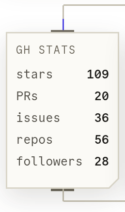</picture></a><a href="https://github.com/parthkapoor-dev?tab=repositories"><picture><source media="(min-width: 1280px) and (prefers-color-scheme: dark)" srcset="./assets/tiles/tele-languages-desktop-dark.png" width="248" height="222" /><source media="(min-width: 1280px) and (prefers-color-scheme: light)" srcset="./assets/tiles/tele-languages-desktop-light.png" width="248" height="222" /><source media="(min-width: 768px) and (prefers-color-scheme: dark)" srcset="./assets/tiles/tele-languages-mobile-dark.png" width="162" /><source media="(min-width: 768px) and (prefers-color-scheme: light)" srcset="./assets/tiles/tele-languages-mobile-light.png" width="162" /><source media="(prefers-color-scheme: dark)" srcset="./assets/tiles/tele-languages-mobile-dark.png" width="108" />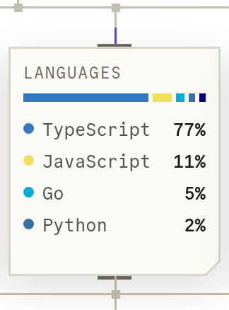</picture></a><a href="https://belzabar.com"><picture><source media="(min-width: 1280px) and (prefers-color-scheme: dark)" srcset="./assets/tiles/tele-now-desktop-dark.png" width="248" height="222" /><source media="(min-width: 1280px) and (prefers-color-scheme: light)" srcset="./assets/tiles/tele-now-desktop-light.png" width="248" height="222" /><source media="(min-width: 768px) and (prefers-color-scheme: dark)" srcset="./assets/tiles/tele-now-mobile-dark.png" width="129" /><source media="(min-width: 768px) and (prefers-color-scheme: light)" srcset="./assets/tiles/tele-now-mobile-light.png" width="129" /><source media="(prefers-color-scheme: dark)" srcset="./assets/tiles/tele-now-mobile-dark.png" width="86" />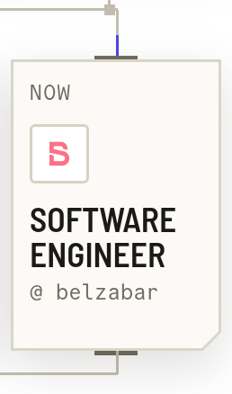</picture></a> <picture><source media="(min-width: 1280px) and (prefers-color-scheme: dark)" srcset="./assets/tiles/label-career-desktop-dark.png" width="744" height="76" /><source media="(min-width: 1280px) and (prefers-color-scheme: light)" srcset="./assets/tiles/label-career-desktop-light.png" width="744" height="76" /><source media="(min-width: 768px) and (prefers-color-scheme: dark)" srcset="./assets/tiles/label-career-mobile-dark.png" width="420" /><source media="(min-width: 768px) and (prefers-color-scheme: light)" srcset="./assets/tiles/label-career-mobile-light.png" width="420" /><source media="(prefers-color-scheme: dark)" srcset="./assets/tiles/label-career-mobile-dark.png" width="280" /></picture> <a href="https://parthkapoor.me/timeline"><picture><source media="(min-width: 1280px) and (prefers-color-scheme: dark)" srcset="./assets/tiles/career-log-desktop-dark.png" width="744" height="344" /><source media="(min-width: 1280px) and (prefers-color-scheme: light)" srcset="./assets/tiles/career-log-desktop-light.png" width="744" height="344" /><source media="(min-width: 768px) and (prefers-color-scheme: dark)" srcset="./assets/tiles/career-log-mobile-dark.png" width="420" /><source media="(min-width: 768px) and (prefers-color-scheme: light)" srcset="./assets/tiles/career-log-mobile-light.png" width="420" /><source media="(prefers-color-scheme: dark)" srcset="./assets/tiles/career-log-mobile-dark.png" width="280" />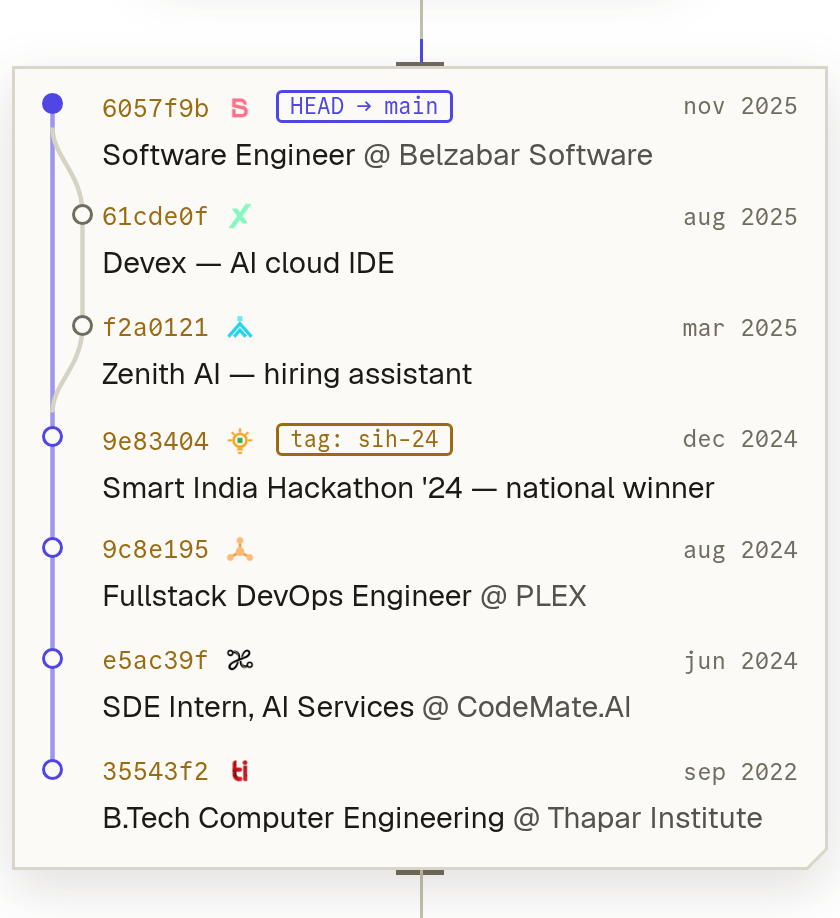</picture></a> <picture><source media="(min-width: 1280px) and (prefers-color-scheme: dark)" srcset="./assets/tiles/label-contact-desktop-dark.png" width="744" height="76" /><source media="(min-width: 1280px) and (prefers-color-scheme: light)" srcset="./assets/tiles/label-contact-desktop-light.png" width="744" height="76" /><source media="(min-width: 768px) and (prefers-color-scheme: dark)" srcset="./assets/tiles/label-contact-mobile-dark.png" width="420" /><source media="(min-width: 768px) and (prefers-color-scheme: light)" srcset="./assets/tiles/label-contact-mobile-light.png" width="420" /><source media="(prefers-color-scheme: dark)" srcset="./assets/tiles/label-contact-mobile-dark.png" width="280" /></picture> <a href="https://parthkapoor.me"><picture><source media="(min-width: 1280px) and (prefers-color-scheme: dark)" srcset="./assets/tiles/social-web-desktop-dark.png" width="124" height="142" /><source media="(min-width: 1280px) and (prefers-color-scheme: light)" srcset="./assets/tiles/social-web-desktop-light.png" width="124" height="142" /><source media="(min-width: 768px) and (prefers-color-scheme: dark)" srcset="./assets/tiles/social-web-mobile-dark.png" width="69" /><source media="(min-width: 768px) and (prefers-color-scheme: light)" srcset="./assets/tiles/social-web-mobile-light.png" width="69" /><source media="(prefers-color-scheme: dark)" srcset="./assets/tiles/social-web-mobile-dark.png" width="46" />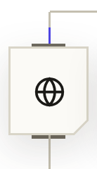</picture></a><a href="https://twitter.com/parthkapoor_te"><picture><source media="(min-width: 1280px) and (prefers-color-scheme: dark)" srcset="./assets/tiles/social-x-desktop-dark.png" width="124" height="142" /><source media="(min-width: 1280px) and (prefers-color-scheme: light)" srcset="./assets/tiles/social-x-desktop-light.png" width="124" height="142" /><source media="(min-width: 768px) and (prefers-color-scheme: dark)" srcset="./assets/tiles/social-x-mobile-dark.png" width="71" /><source media="(min-width: 768px) and (prefers-color-scheme: light)" srcset="./assets/tiles/social-x-mobile-light.png" width="71" /><source media="(prefers-color-scheme: dark)" srcset="./assets/tiles/social-x-mobile-dark.png" width="47" />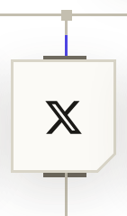</picture></a><a href="https://linkedin.com/in/parthkapoor08"><picture><source media="(min-width: 1280px) and (prefers-color-scheme: dark)" srcset="./assets/tiles/social-linkedin-desktop-dark.png" width="124" height="142" /><source media="(min-width: 1280px) and (prefers-color-scheme: light)" srcset="./assets/tiles/social-linkedin-desktop-light.png" width="124" height="142" /><source media="(min-width: 768px) and (prefers-color-scheme: dark)" srcset="./assets/tiles/social-linkedin-mobile-dark.png" width="71" /><source media="(min-width: 768px) and (prefers-color-scheme: light)" srcset="./assets/tiles/social-linkedin-mobile-light.png" width="71" /><source media="(prefers-color-scheme: dark)" srcset="./assets/tiles/social-linkedin-mobile-dark.png" width="47" />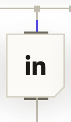</picture></a><a href="mailto:parthkapoor.coder@gmail.com"><picture><source media="(min-width: 1280px) and (prefers-color-scheme: dark)" srcset="./assets/tiles/social-mail-desktop-dark.png" width="124" height="142" /><source media="(min-width: 1280px) and (prefers-color-scheme: light)" srcset="./assets/tiles/social-mail-desktop-light.png" width="124" height="142" /><source media="(min-width: 768px) and (prefers-color-scheme: dark)" srcset="./assets/tiles/social-mail-mobile-dark.png" width="71" /><source media="(min-width: 768px) and (prefers-color-scheme: light)" srcset="./assets/tiles/social-mail-mobile-light.png" width="71" /><source media="(prefers-color-scheme: dark)" srcset="./assets/tiles/social-mail-mobile-dark.png" width="47" /></picture></a><a href="https://cal.com/parthkapoor"><picture><source media="(min-width: 1280px) and (prefers-color-scheme: dark)" srcset="./assets/tiles/social-cal-desktop-dark.png" width="124" height="142" /><source media="(min-width: 1280px) and (prefers-color-scheme: light)" srcset="./assets/tiles/social-cal-desktop-light.png" width="124" height="142" /><source media="(min-width: 768px) and (prefers-color-scheme: dark)" srcset="./assets/tiles/social-cal-mobile-dark.png" width="71" /><source media="(min-width: 768px) and (prefers-color-scheme: light)" srcset="./assets/tiles/social-cal-mobile-light.png" width="71" /><source media="(prefers-color-scheme: dark)" srcset="./assets/tiles/social-cal-mobile-dark.png" width="47" />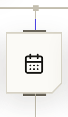</picture></a><a href="https://parthkapoor.me/resume"><picture><source media="(min-width: 1280px) and (prefers-color-scheme: dark)" srcset="./assets/tiles/social-resume-desktop-dark.png" width="124" height="142" /><source media="(min-width: 1280px) and (prefers-color-scheme: light)" srcset="./assets/tiles/social-resume-desktop-light.png" width="124" height="142" /><source media="(min-width: 768px) and (prefers-color-scheme: dark)" srcset="./assets/tiles/social-resume-mobile-dark.png" width="69" /><source media="(min-width: 768px) and (prefers-color-scheme: light)" srcset="./assets/tiles/social-resume-mobile-light.png" width="69" /><source media="(prefers-color-scheme: dark)" srcset="./assets/tiles/social-resume-mobile-dark.png" width="46" />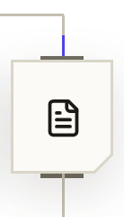</picture></a> <picture><source media="(min-width: 1280px) and (prefers-color-scheme: dark)" srcset="./assets/tiles/eof-desktop-dark.png" width="744" height="132" /><source media="(min-width: 1280px) and (prefers-color-scheme: light)" srcset="./assets/tiles/eof-desktop-light.png" width="744" height="132" /><source media="(min-width: 768px) and (prefers-color-scheme: dark)" srcset="./assets/tiles/eof-mobile-dark.png" width="420" /><source media="(min-width: 768px) and (prefers-color-scheme: light)" srcset="./assets/tiles/eof-mobile-light.png" width="420" /><source media="(prefers-color-scheme: dark)" srcset="./assets/tiles/eof-mobile-dark.png" width="280" />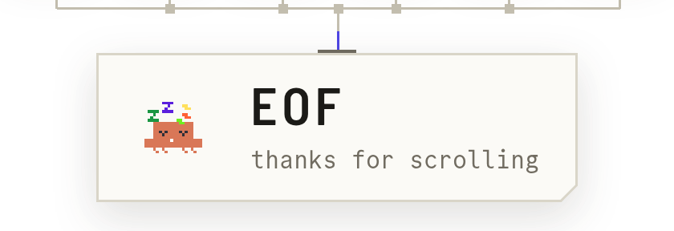</picture>

re-rendered every 12 hours by github actions · bun + puppeteer · design tokens from <a href="https://parthkapoor.me">parthkapoor.me</a>

