<!-- Generated by `bun run index.ts` from src/ — edit there, not here. -->

<picture><source media="(prefers-color-scheme: dark)" srcset="./assets/hero-dark.svg" /></picture> <picture><source media="(min-width: 1280px) and (prefers-color-scheme: dark)" srcset="./assets/tiles/label-work-wire-dark.png" width="744" height="76" /><source media="(min-width: 1280px) and (prefers-color-scheme: light)" srcset="./assets/tiles/label-work-wire-light.png" width="744" height="76" /><source media="(prefers-color-scheme: dark)" srcset="./assets/tiles/label-work-card-dark.png" />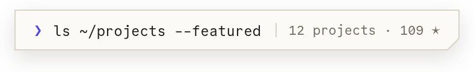</picture> <a href="https://devx.parthkapoor.me"><picture><source media="(min-width: 1280px) and (prefers-color-scheme: dark)" srcset="./assets/tiles/project-devx-wire-dark.png" width="248" height="412" /><source media="(min-width: 1280px) and (prefers-color-scheme: light)" srcset="./assets/tiles/project-devx-wire-light.png" width="248" height="412" /><source media="(prefers-color-scheme: dark)" srcset="./assets/tiles/project-devx-card-dark.png" />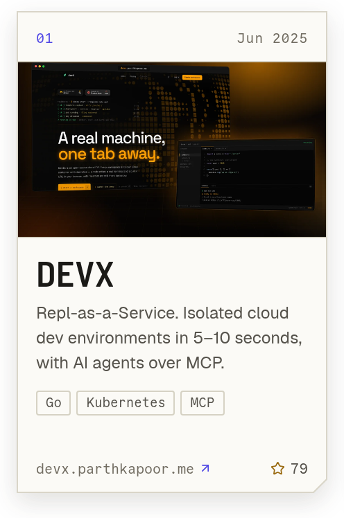</picture></a><a href="https://void.parthkapoor.me"><picture><source media="(min-width: 1280px) and (prefers-color-scheme: dark)" srcset="./assets/tiles/project-void-design-wire-dark.png" width="248" height="412" /><source media="(min-width: 1280px) and (prefers-color-scheme: light)" srcset="./assets/tiles/project-void-design-wire-light.png" width="248" height="412" /><source media="(prefers-color-scheme: dark)" srcset="./assets/tiles/project-void-design-card-dark.png" />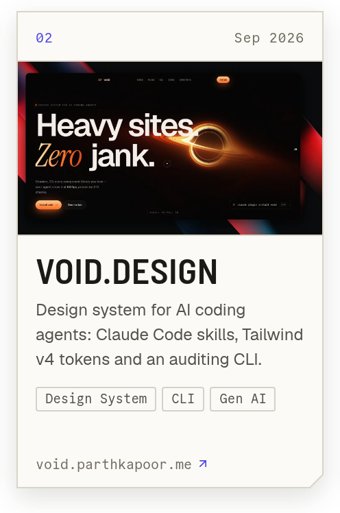</picture></a><a href="https://zenith.parthkapoor.me"><picture><source media="(min-width: 1280px) and (prefers-color-scheme: dark)" srcset="./assets/tiles/project-zenith-ai-wire-dark.png" width="248" height="412" /><source media="(min-width: 1280px) and (prefers-color-scheme: light)" srcset="./assets/tiles/project-zenith-ai-wire-light.png" width="248" height="412" /><source media="(prefers-color-scheme: dark)" srcset="./assets/tiles/project-zenith-ai-card-dark.png" />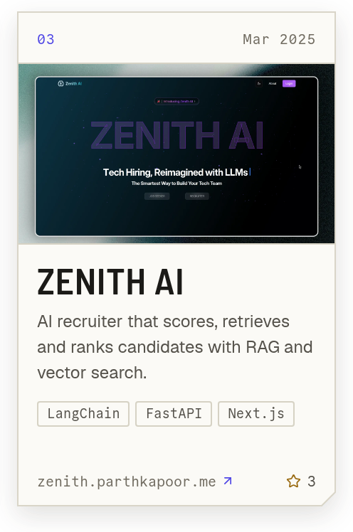</picture></a> <a href="https://better-axios.parthkapoor.me"><picture><source media="(min-width: 1280px) and (prefers-color-scheme: dark)" srcset="./assets/tiles/project-better-axios-wire-dark.png" width="372" height="176" /><source media="(min-width: 1280px) and (prefers-color-scheme: light)" srcset="./assets/tiles/project-better-axios-wire-light.png" width="372" height="176" /><source media="(prefers-color-scheme: dark)" srcset="./assets/tiles/project-better-axios-card-dark.png" />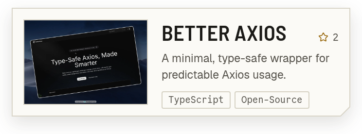</picture></a><a href="https://lexa.parthkapoor.me"><picture><source media="(min-width: 1280px) and (prefers-color-scheme: dark)" srcset="./assets/tiles/project-lexa-ai-wire-dark.png" width="372" height="176" /><source media="(min-width: 1280px) and (prefers-color-scheme: light)" srcset="./assets/tiles/project-lexa-ai-wire-light.png" width="372" height="176" /><source media="(prefers-color-scheme: dark)" srcset="./assets/tiles/project-lexa-ai-card-dark.png" />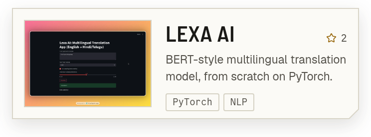</picture></a> <a href="https://github.com/parthkapoor-dev/hopster"><picture><source media="(min-width: 1280px) and (prefers-color-scheme: dark)" srcset="./assets/tiles/project-hopster-wire-dark.png" width="248" height="158" /><source media="(min-width: 1280px) and (prefers-color-scheme: light)" srcset="./assets/tiles/project-hopster-wire-light.png" width="248" height="158" /><source media="(prefers-color-scheme: dark)" srcset="./assets/tiles/project-hopster-card-dark.png" />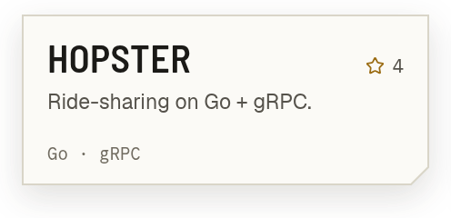</picture></a><a href="https://github.com/parthkapoor-dev/tori-cli"><picture><source media="(min-width: 1280px) and (prefers-color-scheme: dark)" srcset="./assets/tiles/project-tori-cli-wire-dark.png" width="248" height="158" /><source media="(min-width: 1280px) and (prefers-color-scheme: light)" srcset="./assets/tiles/project-tori-cli-wire-light.png" width="248" height="158" /><source media="(prefers-color-scheme: dark)" srcset="./assets/tiles/project-tori-cli-card-dark.png" />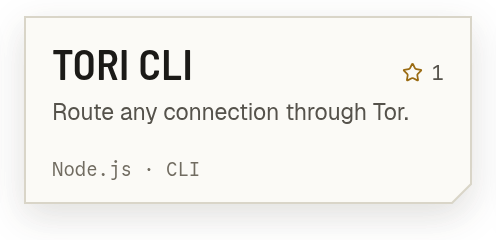</picture></a><a href="https://parthkapoor.me/projects"><picture><source media="(min-width: 1280px) and (prefers-color-scheme: dark)" srcset="./assets/tiles/project-index-wire-dark.png" width="248" height="158" /><source media="(min-width: 1280px) and (prefers-color-scheme: light)" srcset="./assets/tiles/project-index-wire-light.png" width="248" height="158" /><source media="(prefers-color-scheme: dark)" srcset="./assets/tiles/project-index-card-dark.png" />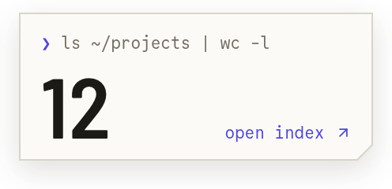</picture></a> <picture><source media="(min-width: 1280px) and (prefers-color-scheme: dark)" srcset="./assets/tiles/label-telemetry-wire-dark.png" width="744" height="76" /><source media="(min-width: 1280px) and (prefers-color-scheme: light)" srcset="./assets/tiles/label-telemetry-wire-light.png" width="744" height="76" /><source media="(prefers-color-scheme: dark)" srcset="./assets/tiles/label-telemetry-card-dark.png" />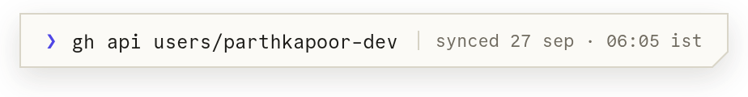</picture> <a href="https://github.com/parthkapoor-dev"><picture><source media="(min-width: 1280px) and (prefers-color-scheme: dark)" srcset="./assets/tiles/tele-heatmap-wire-dark.png" width="496" height="204" /><source media="(min-width: 1280px) and (prefers-color-scheme: light)" srcset="./assets/tiles/tele-heatmap-wire-light.png" width="496" height="204" /><source media="(prefers-color-scheme: dark)" srcset="./assets/tiles/tele-heatmap-card-dark.png" />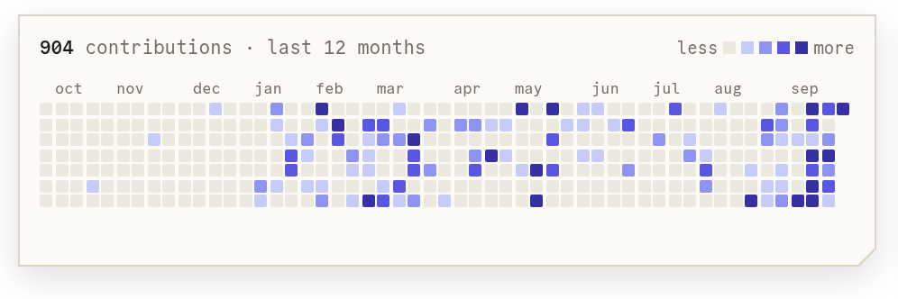</picture></a><a href="https://github.com/parthkapoor-dev"><picture><source media="(min-width: 1280px) and (prefers-color-scheme: dark)" srcset="./assets/tiles/tele-streak-wire-dark.png" width="248" height="204" /><source media="(min-width: 1280px) and (prefers-color-scheme: light)" srcset="./assets/tiles/tele-streak-wire-light.png" width="248" height="204" /><source media="(prefers-color-scheme: dark)" srcset="./assets/tiles/tele-streak-card-dark.png" />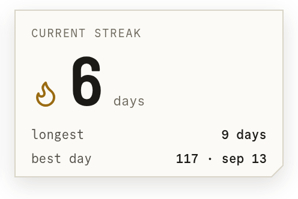</picture></a> <a href="https://github.com/parthkapoor-dev?tab=repositories"><picture><source media="(min-width: 1280px) and (prefers-color-scheme: dark)" srcset="./assets/tiles/tele-numbers-wire-dark.png" width="248" height="222" /><source media="(min-width: 1280px) and (prefers-color-scheme: light)" srcset="./assets/tiles/tele-numbers-wire-light.png" width="248" height="222" /><source media="(prefers-color-scheme: dark)" srcset="./assets/tiles/tele-numbers-card-dark.png" />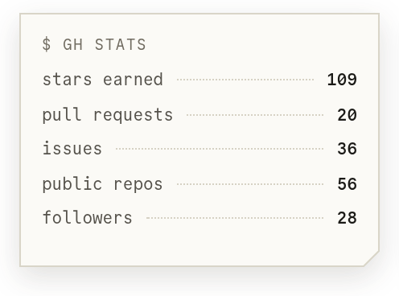</picture></a><a href="https://github.com/parthkapoor-dev?tab=repositories"><picture><source media="(min-width: 1280px) and (prefers-color-scheme: dark)" srcset="./assets/tiles/tele-languages-wire-dark.png" width="248" height="222" /><source media="(min-width: 1280px) and (prefers-color-scheme: light)" srcset="./assets/tiles/tele-languages-wire-light.png" width="248" height="222" /><source media="(prefers-color-scheme: dark)" srcset="./assets/tiles/tele-languages-card-dark.png" />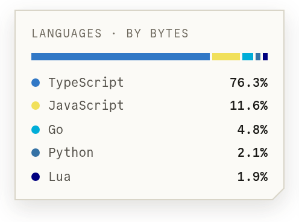</picture></a><a href="https://belzabar.com"><picture><source media="(min-width: 1280px) and (prefers-color-scheme: dark)" srcset="./assets/tiles/tele-now-wire-dark.png" width="248" height="222" /><source media="(min-width: 1280px) and (prefers-color-scheme: light)" srcset="./assets/tiles/tele-now-wire-light.png" width="248" height="222" /><source media="(prefers-color-scheme: dark)" srcset="./assets/tiles/tele-now-card-dark.png" />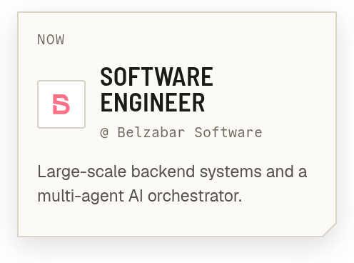</picture></a> <picture><source media="(min-width: 1280px) and (prefers-color-scheme: dark)" srcset="./assets/tiles/label-career-wire-dark.png" width="744" height="76" /><source media="(min-width: 1280px) and (prefers-color-scheme: light)" srcset="./assets/tiles/label-career-wire-light.png" width="744" height="76" /><source media="(prefers-color-scheme: dark)" srcset="./assets/tiles/label-career-card-dark.png" />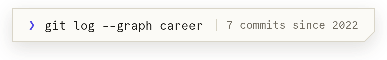</picture> <a href="https://parthkapoor.me/timeline"><picture><source media="(min-width: 1280px) and (prefers-color-scheme: dark)" srcset="./assets/tiles/career-log-wire-dark.png" width="744" height="344" /><source media="(min-width: 1280px) and (prefers-color-scheme: light)" srcset="./assets/tiles/career-log-wire-light.png" width="744" height="344" /><source media="(prefers-color-scheme: dark)" srcset="./assets/tiles/career-log-card-dark.png" />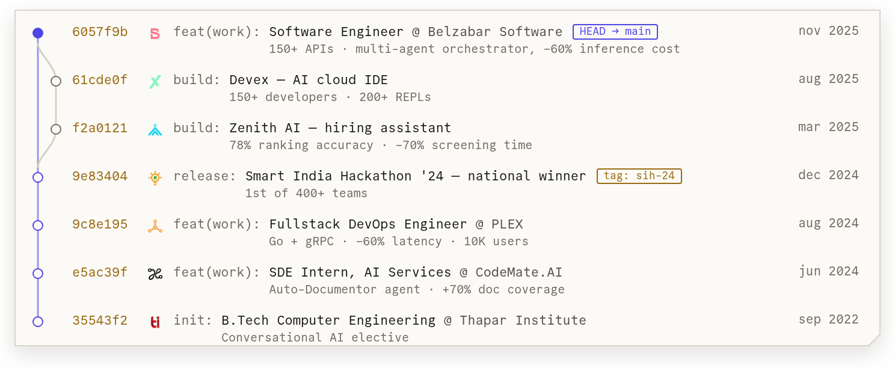</picture></a> <picture><source media="(min-width: 1280px) and (prefers-color-scheme: dark)" srcset="./assets/tiles/label-contact-wire-dark.png" width="744" height="76" /><source media="(min-width: 1280px) and (prefers-color-scheme: light)" srcset="./assets/tiles/label-contact-wire-light.png" width="744" height="76" /><source media="(prefers-color-scheme: dark)" srcset="./assets/tiles/label-contact-card-dark.png" />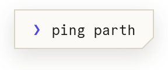</picture> <a href="https://parthkapoor.me"><picture><source media="(min-width: 1280px) and (prefers-color-scheme: dark)" srcset="./assets/tiles/social-web-wire-dark.png" width="124" height="142" /><source media="(min-width: 1280px) and (prefers-color-scheme: light)" srcset="./assets/tiles/social-web-wire-light.png" width="124" height="142" /><source media="(prefers-color-scheme: dark)" srcset="./assets/tiles/social-web-card-dark.png" />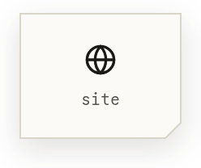</picture></a><a href="https://twitter.com/parthkapoor_te"><picture><source media="(min-width: 1280px) and (prefers-color-scheme: dark)" srcset="./assets/tiles/social-x-wire-dark.png" width="124" height="142" /><source media="(min-width: 1280px) and (prefers-color-scheme: light)" srcset="./assets/tiles/social-x-wire-light.png" width="124" height="142" /><source media="(prefers-color-scheme: dark)" srcset="./assets/tiles/social-x-card-dark.png" />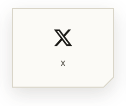</picture></a><a href="https://linkedin.com/in/parthkapoor08"><picture><source media="(min-width: 1280px) and (prefers-color-scheme: dark)" srcset="./assets/tiles/social-linkedin-wire-dark.png" width="124" height="142" /><source media="(min-width: 1280px) and (prefers-color-scheme: light)" srcset="./assets/tiles/social-linkedin-wire-light.png" width="124" height="142" /><source media="(prefers-color-scheme: dark)" srcset="./assets/tiles/social-linkedin-card-dark.png" /></picture></a><a href="mailto:parthkapoor.coder@gmail.com"><picture><source media="(min-width: 1280px) and (prefers-color-scheme: dark)" srcset="./assets/tiles/social-mail-wire-dark.png" width="124" height="142" /><source media="(min-width: 1280px) and (prefers-color-scheme: light)" srcset="./assets/tiles/social-mail-wire-light.png" width="124" height="142" /><source media="(prefers-color-scheme: dark)" srcset="./assets/tiles/social-mail-card-dark.png" /></picture></a><a href="https://cal.com/parthkapoor"><picture><source media="(min-width: 1280px) and (prefers-color-scheme: dark)" srcset="./assets/tiles/social-cal-wire-dark.png" width="124" height="142" /><source media="(min-width: 1280px) and (prefers-color-scheme: light)" srcset="./assets/tiles/social-cal-wire-light.png" width="124" height="142" /><source media="(prefers-color-scheme: dark)" srcset="./assets/tiles/social-cal-card-dark.png" /></picture></a><a href="https://parthkapoor.me/resume"><picture><source media="(min-width: 1280px) and (prefers-color-scheme: dark)" srcset="./assets/tiles/social-resume-wire-dark.png" width="124" height="142" /><source media="(min-width: 1280px) and (prefers-color-scheme: light)" srcset="./assets/tiles/social-resume-wire-light.png" width="124" height="142" /><source media="(prefers-color-scheme: dark)" srcset="./assets/tiles/social-resume-card-dark.png" /></picture></a> <picture><source media="(min-width: 1280px) and (prefers-color-scheme: dark)" srcset="./assets/tiles/eof-wire-dark.png" width="744" height="132" /><source media="(min-width: 1280px) and (prefers-color-scheme: light)" srcset="./assets/tiles/eof-wire-light.png" width="744" height="132" /><source media="(prefers-color-scheme: dark)" srcset="./assets/tiles/eof-card-dark.png" />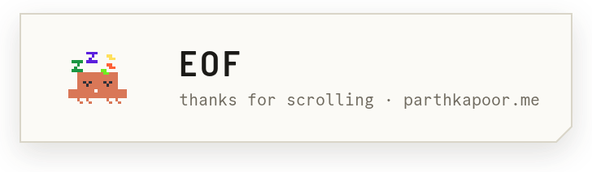</picture>

re-rendered every 12 hours by github actions · bun + puppeteer · design tokens from <a href="https://parthkapoor.me">parthkapoor.me</a>

